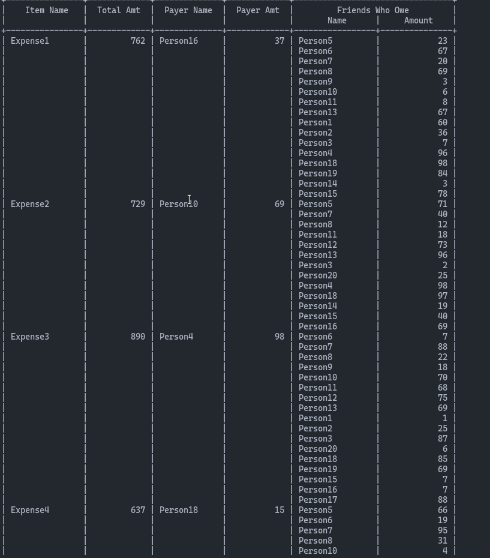

# Expense Tracker Agent

## How to Run this thing

```bash
export GOOGLE_GENAI_USE_VERTEXAI=FALSE
export GOOGLE_API_KEY= <your API key>
```

To access the web agent, run the following command in the terminal:

```bash
mvn exec:java -Dexec.mainClass="com.google.adk.web.AdkWebServer" -Dexec.args="--adk.agents.source-dir=src/main/java" -Dexec.classpathScope="compile"
```


# About the Expense Tracker Agent

Managing expenses among friends or colleagues can be a real headache, right? Who owes what? Did someone forget to pay their share? Enter the Expense Tracker Agent—a tool designed to make your life easier. Whether you're splitting a dinner bill or managing expenses for a large group, this agent has got you covered. And the best part? It can handle up to **10 thousand participants without breaking a sweat**. Yes, you read that **right—10 thousand**! (**Disclaimer**: This is possible for the Algorithmic version implimented in the Core logic .. may break when data given to AI Chat agents)

### Features:
- **Expense Tracking**: Keep tabs on who paid what and who owes whom.
- **Detailed Reports**: Get clear, concise transaction logs and balance sheets.
- **Scalability**: Handles massive groups effortlessly—perfect for everything from small gatherings to enterprise-level needs.
- **API Integration**: Seamlessly integrate with other systems for added functionality.
- **Session Management**: Start fresh with new sessions whenever you need.
- **User-Friendly Design**: Built to be intuitive and straightforward.

### Beyond the Agent:
This isn't just a tool; it's a powerhouse of efficiency. The core logic is designed to handle an extraordinary number of participants with ease, making it a go-to solution for developers and businesses alike. Whether you're building your own app or need a reliable API, this project has you covered.

# Core Logic

## `/core/Expense`
Think of the `Expense` class as the building block of this system. It captures all the nitty-gritty details of a single transaction:
- **Item Name**: What was the expense for? (e.g., "Lunch")
- **Total Amount**: How much did it cost?
- **Payer Name and Amount**: Who paid and how much?
- **Friends and Amounts Owed**: Who owes what?

This class ensures that every transaction is logged and ready for further processing.

## `/core/ExpenseTrackerCore`
Now, this is where the magic happens. The `ExpenseTrackerCore` class is the brain of the operation. Here's what it does:
- **Manages Sessions**: Keeps track of all expenses and participants.
- **Updates Balances**: Ensures everyone knows who owes what.
- **Generates Reports**: Provides detailed logs and balance sheets.
- **Resets Easily**: Start fresh whenever you need to.

# Structure Overview

### Model
The `Model` package is all about the people involved. The `Person` class:
- Tracks individual balances with others.
- Makes updating balances a breeze.

### Core
The `Core` package is the engine that drives everything. It handles all the heavy lifting, from managing expenses to updating balances.

### State
The `State` package ensures everything runs smoothly. The `ExpenseTrackerStateManager` guarantees that there's only one instance of the core logic, keeping things consistent and efficient.

# How It All Works

1. **Initialization**: The `ExpenseTrackerStateManager` sets up a single instance of `ExpenseTrackerCore`.
2. **Adding Expenses**: Use the `ExpenseTrackerAgent` to log expenses, which updates balances automatically.
3. **Generating Reports**: Get detailed logs and balance sheets with just a few clicks.
4. **Session Management**: Reset sessions to start fresh whenever you need.

# TODO

- **UI Support**: A sleek, user-friendly interface is on the horizon.
- **API Expansion**: More features for seamless integration.


# Images





